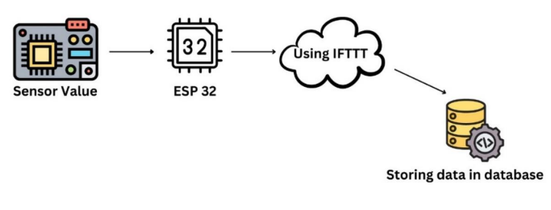
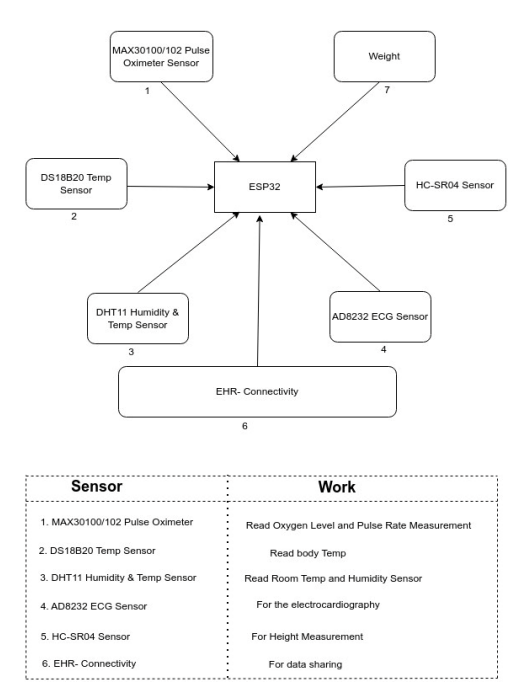
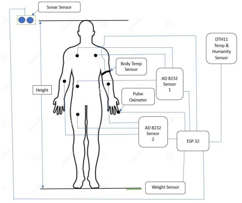
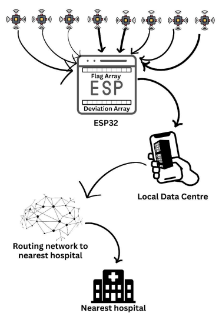
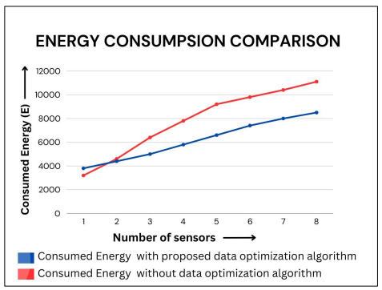

# ❤️ Heart Smart Tech
## IoT-Enhanced Smart Healthcare Monitoring System with Energy Efficient Data Compression

<p align="center">
  
  
  
  
</p>

---

# 📌 Project Overview

Heart Smart Tech is an advanced IoT-based healthcare monitoring system developed using ESP32 microcontrollers and biomedical sensors for real-time patient monitoring and intelligent emergency response.

The system focuses on:

- Real-time health parameter acquisition
- Wireless sensor network optimization
- Energy-efficient data transmission
- Smart data compression techniques
- Emergency alert routing
- IoT-enabled healthcare automation

This project minimizes transmission overhead by sending only abnormal deviations instead of continuous raw sensor data.

---

# 🧠 Key Features

✅ Real-time patient monitoring  
✅ ESP32-based wireless sensor communication  
✅ Pulse & ECG monitoring  
✅ Temperature & humidity sensing  
✅ Smart anomaly detection  
✅ SOS emergency alert system  
✅ Energy-efficient communication  
✅ Data compression using deviation-based encoding  
✅ Routing to nearest hospital  
✅ Reduced bandwidth utilization  
✅ IoT + Embedded Systems integration

---

# 🏗️ Hardware Architecture

<p align="center">
  
</p>

---

# 📡 Sensor Connectivity

<p align="center">
  
</p>

---

# 🧍 Human Body Sensor Placement

<p align="center">
  
</p>

---

# 🔄 Data Transmission Workflow

<p align="center">
  
</p>

---

# ⚡ Energy Consumption Analysis

The proposed data optimization algorithm significantly reduces energy consumption compared to traditional sensor transmission systems.

<p align="center">
  
</p>

---

# 🛠️ Technologies Used

| Category | Technologies |
|---|---|
| Microcontroller | ESP32 |
| Programming | Embedded C++, Arduino |
| Sensors | MAX30100, AD8232, DHT11, DS18B20, HC-SR04 |
| Communication | GSM, IoT |
| Concepts | Wireless Sensor Networks, Data Compression |
| Cloud | IFTTT, Database Integration |
| Algorithms | Modified Reverse Dijkstra Algorithm |

---

# 🔌 Sensors Used

| Sensor | Purpose |
|---|---|
| MAX30100/MAX30102 | Pulse & Oxygen Monitoring |
| AD8232 | ECG Monitoring |
| DS18B20 | Body Temperature |
| DHT11 | Temperature & Humidity |
| HC-SR04 | Height Measurement |
| Weight Sensor | Weight Monitoring |
| ESP32 | Central Controller |

---

# 🧪 Proposed Compression Logic

The project uses:

- Boolean flag arrays
- Deviation arrays
- Threshold-based transmission
- Reduced bit transmission
- Smart anomaly filtering

Instead of continuously transmitting complete sensor values, the system sends only abnormal deviations.

This dramatically reduces:

- Power consumption
- Transmission overhead
- Sensor bandwidth usage
- Energy utilization

---

# 🚨 Emergency Alert Mechanism

If abnormal sensor readings persist:

1. ESP32 validates anomaly
2. Local data center receives alert
3. SOS packet generated
4. Modified reverse Dijkstra routing applied
5. Alert forwarded to nearest hospital

This ensures fast emergency response with optimized network efficiency.

---

# 📂 Project Structure

```bash
├── code/
├── docs/
├── hardware/
├── images/
├── results/
└── research/
```

---

# 📄 Research Report

📘 Complete project report available in:

```bash
docs/Project_Report.pdf
```

---

# 🚀 Future Improvements

- AI-based disease prediction
- Cloud dashboard integration
- Mobile application
- MQTT communication
- Edge AI processing
- Deep learning for ECG analysis
- Real-time cloud analytics

---

# 👨‍💻 Team Members

- Arpan Pramanick
- Arpan Nandi
- Ayan Sarkar
- Ayush Kumar

---

# 🎓 Institution

Haldia Institute of Technology  
Department of Information Technology

---

# 📜 License

This project is developed for academic and research purposes.

Licensed under the MIT License.

---

# ⭐ Support

If you found this project useful, give this repository a ⭐ on GitHub.
